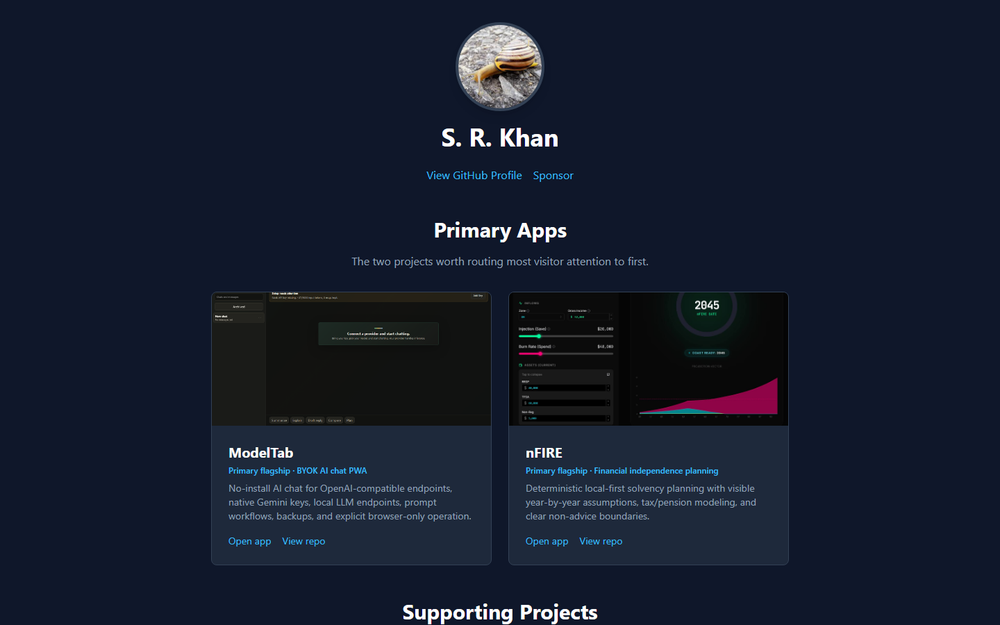

# Shafiqur Khan Portfolio

<p><a href="https://github.com/sponsors/shfqrkhn?o=esb"><strong>Sponsor this project</strong></a></p>

Curated GitHub Pages launchpad for a focused public project portfolio.

- **Status:** Active portfolio hub
- **Version:** v1.2.49
- **Live Demo:** [shfqrkhn.github.io](https://shfqrkhn.github.io/)
- **Portfolio Role:** Discovery surface for the flagship projects.
- **Maintainer handoff:** [`docs/AI_MAINTAINER_HANDOFF.md`](./docs/AI_MAINTAINER_HANDOFF.md)

This site routes attention to the strongest public projects first instead of giving every repository equal weight.

## Screenshot



## Why This Exists

A portfolio should reduce noise, not amplify repo sprawl. This site keeps the primary products visible even before GitHub API data loads, then uses public repository data for a small supporting set.

## Featured Project Strategy

Primary flagships:

- `ModelTab`: no-install BYOK AI chat PWA.
- `nFIRE`: financial independence and solvency planning.
- `FIFA-WC-Sim`: transparent World Cup simulation and prediction-audit workflow.

Supporting projects:

- `LocalFirstApps`

## What It Does

- Presents ModelTab, nFIRE, and FIFA-WC-Sim as static primary cards with screenshots and direct app/repo links.
- Fetches public GitHub profile and repository data.
- Filters out forks, consolidated redirect repos, primary-card duplicates, and non-focused repos.
- Renders project cards with description, language, stars, and update date.
- Prioritizes the curated supporting set ahead of general sorting.
- Routes consolidated utility apps through LocalFirstApps instead of former standalone repos.
- Caches GitHub API responses locally to reduce rate-limit pressure.

## Quick Start

1. Open the live portfolio.
2. Start with the featured projects.
3. Use stable companions and maintenance apps when relevant.
4. Visit individual repositories for live demos and details.

## Privacy And Data Model

- Uses public GitHub API data only.
- Caches fetched public data in localStorage.
- No backend or analytics service is required.

## Relationship To Other Projects

This repo is the front door. It should not compete with the product repos; it should route attention to the strongest projects.

## Repository Layout

```text
.
├── index.html
├── script.js
├── styles.css
├── media/
├── src/
├── tests/
└── package.json
```

## Deployment

This is the account-level GitHub Pages site served from the repository root.

## Quality Gates

```bash
npm test
```

## Maintenance

Keep project ranking intentional. Do not showcase every repo equally when the goal is focus, adoption, and clear user pathways.

## License

See `LICENSE`.
